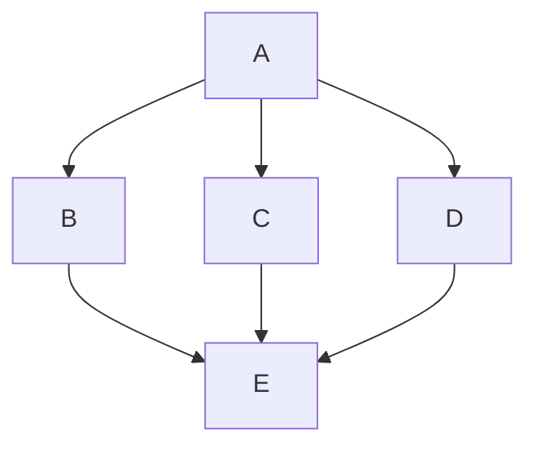

> ahaip<sup>TM</sup>，人生是**修行**，也是**旅行**，多**结伴同行**，深度体验人间美好...


> 此时此地，此人此事

---

# Evolution

1. **使命**：创造和运用知识产权，助力公司经营及发展
2. **愿景**：成为产业界具有影响力的知识产权实务专家
3. **价值观**：<ins>天道酬勤</ins>、<ins>人道酬善</ins>、<ins>商道酬信</ins>
4. **路径**：<ins>高级程序员（技术）</ins>、<ins>专利代理师（法律）</ins>、<ins>职业经理人（商务）</ins>

```
1. 识不足则多虑
2. 威不足则多怒
3. 信不足则多言
4. 智者搭台、强者补台、弱者拆台
5. 见天地（知敬畏，所以谦卑），见众生（懂怜悯，所以宽容），见自己（明归途，所以豁达）
6. 修己安人，严于律己，宽以待人
7. 独立自主，强强联合，协作共赢
8. 专业权威，人格魅力，岗位权力
```

```
1. 个人 vs 团队
2. 局部 vs 全局
3. 当前 vs 长远
4. 过程 vs 结果
5. 事情 vs 关系
6. 关系 vs 利益
```

---

# Invest


> 盛世中华

1. 变现的逻辑是能够为他人创造价值（帮他人解决问题）
2. 收入=本金*(1+利率)时长
3. 机会主义->暂时；实用主义->阶段；长期主义->持续
4. 如何成为长期主义者？很简单，做难而正确的事情
5. 复杂事情简单化，简单事情重复做，复利的力量
6. 理性三要素：有知识，无偏见，合乎逻辑
7. 因相信而看见，从量变到质变，持续不断记录，意义自然浮现...


---

# ahaip

1. 入眼，入耳，入脑
2. 实事求是，相信科学，尊重常识（概率）
3. 走老路到不了新目的地
4. 奋斗的道路上永远不孤单，你永远不是一个人在战斗
5. 一个人的心里同时存在两个角色，自己与他人，人的成长就是从**只有自我到成就他人**
6. 一个人同时生活在两个世界，一个想象世界一个现实世界，人的成长就是不断提高这两个世界的**重合度**
7. 发现、体验及创造美...


> 修己安人，阅己惜福，轻言细语，和颜悦色...


| 年份  | 月份 | 周数 | 日数 |
| ----- |  :------:  |  :------:  | :------:  |
| 2024     | 3       | 4        | 30          |
| 2024     | 3       | 4         | 31         |
| 2024     | 4       | 1         | 5          |
| 2024     | 4       | 1         | 6          |
| 2024     | 4       | 2         | 13         |
| 2024     | 4       | 2         | 14         |
| 2024     | 4       | 3         | 15         |
| 2024     | 4       | 3         | 20         |
| 2024     | 4       | 3         | 21         |
| 2024     | 4       | 4         | 27         |
| 2024     | 4       | 5         | 30         |
| 2024     | 5       | 1         | 1          |
| 2024     | 5       | 1         | 3          |
| 2024     | 5       | 1         | 4          |
| 2024     | 5       | 1         | 5          |
| 2024     | 5       | 2         | 12         |
| 2024     | 5       | 3         | 18         |
| 2024     | 5       | 3         | 19         |
| 2024     | 5       | 4         | 25         |
| 2024     | 5       | 4         | 26         |
| 2024     | 6       | 1         | 8          |
| 2024     | 6       | 1         | 10         |
| 2024     | 6       | 2         | 15         |
| 2024     | 6       | 2         | 16         |
| 2024     | 6       | 3         | 22         |
| 2024     | 6       | 3         | 23         |
| 2024     | 6       | 4         | 29         |
| 2024     | 6       | 4         | 30         |
| 2024     | 7       | 1         | 06         |
| 2024     | 7       | 1         | 07         |
| 2024     | 7       | 2         | 14         |
| 2024     | 7       | 3         | 20         |
| 2024     | 7       | 3         | 21         |
| 2024     | 7       | 4         | 27         |
| 2024     | 7       | 4         | 28         |
| 2024     | 8       | 1         | 3          |
| 2024     | 8       | 1         | 4          |
| 2024     | 8       | 2         | 10         |
| 2024     | 8       | 2         | 11         |
| 2024     | 8       | 3         | 17         |
| 2024     | 8       | 3         | 18         |
| 2024     | 8       | 4         | 24         |
| 2024     | 8       | 4         | 25         |
| 2024     | 8       | 5         | 31         |
| 2024     | 9       | 1         | 7          |
| 2024     | 9       | 1         | 8          |
| 2024     | 9       | 2         | 16         |
| 2024     | 9       | 3         | 21         |
| 2024     | 9       | 3         | 22         |
| 2024     | 9       | 3         | 28         |
| 2024     | 10       | 1         | 3         |
| 2024     | 10       | 1         | 5         |
| 2024     | 10       | 1         | 6         |
| 2024     | 10       | 1         | 7         |
| 2024     | 10       | 1         | 8         |
| 2024     | 10       | 2         | 13        |
| 2024     | 10       | 3         | 19        |
| 2024     | 10       | 3         | 20        |

# Reference


---

为什么说，我连接，所以我存在？答案显而易见。因为我们每个人，都是众多身份的集合。而每个身份，又都存在于某一段关系当中。所以，构建关系，本质上就是在构建自己的存在。

是否建立了足够的连接，不是看你认识人够不够多，而是看，你是否给他人提供了价值。

归根结底，连接，不是你覆盖的广度。而是通过创造价值，嵌入到这个世界的深度。

我连接所以我存在，是否给他人提供了价值，通过创造价值，深度嵌入到这个世界。


> 系统思考，以简驭繁的智慧，是整体地、动态地、连续地思考问题的思维模式


> 极简主义Minimalism，Less is more，简单是最极致的美


> 简洁优雅，接纳，欣赏，协作，平和，宽容，笑容...


> 一切都是**大脑神经连接**🔗，从 0 到 1，持续构建及刷新


> 理性沉浸当下，Now，Only One & No.1


> 高度不够，看到的都是问题. 格局太小，纠结的都是鸡毛蒜皮


> 强者温柔、平和及谦卑，鹰骨鸽风，这是我的事，就事论事，深度思考，高效执行，gap节奏

```
1. 你眼里的他人才是自己
2. 一切都会过去，一切都会来到
3. 进化大脑，升级OS
4. 放松的本质：思维模式的切换
5. 运动产生多巴胺，冥想带回注意力
6. 持续挑战自己，扩展自己的学习区
```


> 实事求是，执行者(做事)-->操盘手(做人)-->决策者(造势)

```
顺势而安
趁势而起
造势而雄
```


> 破局：自求外求而非他求


> 敢用师者王，善用友者强，仅用徒者亡

```
1. 人是社会动物，是所有社会关系的总和
2. 管理的本质：激发和释放每一个人的善意，通过成就他人来成就自己,信任，支持及授权（欣赏的激励）
3. 领导力：动员群众解决难题，激发善意，导向行动，创造价值
4. 事情关系利益，化整为零各个击破
5. 凡事预则立不预则废，不打无准备之仗，天助自助者,铺垫，节奏，趁势
6. 你不是一个人在战斗，也不是个人的私事，每个人都想参与，这是底层驱动力
7. 错失机会，是成长必备的条件，永远不缺好的机会，只缺人才
8. 士气，习惯及行为，体系化，流程化，模板化
```


> 因相信而看见，因看见而行动及坚持，Just do it right now...


> 问题一具体就好办，一定有办法可以解决，行就行，不行我再想想办法，任何时候都来得及


> one by one，day by day，家人、书、自然、友...携手同行，少有正确价值之旅...

---

# Concept

1. 模块：有成熟的解决方案的局部
2. 合作：大家各自放弃一小部分安全感，并把那一部分安全感交由合作方来保障
3. 信任：相信对方不会利用自己主动放弃的那一部分安全感
4. 沟通是一场无限游戏
5. 人是所有社会关系的总和
6. 钥匙不在锁头上

---


> 顶尖选手并没有什么秘诀，而是对可能是基本技能的东西有更深刻的理解，技术、法律、商务、人性...


> Make it Possible 通往山顶的路有很多，选择最难、也最有价值的一条，持续做难而正确的事情。


# Reference


---

<details>
<summary>Who用户是谁？</summary>
  <table>
  <tr><td>内部：客户，业务，领导，团队...</td></tr>
  <tr><td>外部：官方，服务机构，盟友...</td></tr>
  </table>
</details>

<details>
<summary>Why能创造的价值是什么？</summary>
  <table>
  <tr><td>风险防控</td></tr>
  <tr><td>商业竞争</td></tr>
  <tr><td>价值运营</td></tr>  
  </table>
</details>

<details>
<summary>What需要什么能力/经验/人脉？</summary>
  <table>
  <tr><td>高级程序员（技术）📱</td></tr>
  <tr><td>专利代理师（法律）⚖️</td></tr>
  <tr><td>职业经理人（商务）🤝</td></tr>  
  <tr><td>IP储备：打造SEP、国内及海外高价值专利资产</td></tr>
  <tr><td>IP运营：许可诉讼、并购、专项需求</td></tr>
  <tr><td>IP风控：内部（研发、销售、采购、人力等）、外部（展会、海关、认证等）</td></tr>  
  <tr><td></td></tr>  
  </table>
</details>

<details>
<summary>How如何获得相应的能力/经验/人脉？</summary>
  <table>
  <tr><td>自己就是最好的解决方案，唯手熟尔</td></tr>
  <tr><td>选择维度：行业，公司，领导，机会</td></tr>
  <tr><td>体系/类比：如五位一体、三步六法...插头与插座、登山与布局...</td></tr>  
  <tr><td>价值交换：人生的价值在于奉献，金钱/成功只是价值的副产品，而不是目标</td></tr>
  <tr><td>化繁为简，静水流深，深度思考，积蓄能量，三思而行，整合资源，聚焦于目标及快速达成...</td></tr>
  <tr><td>，故事力，通过讲故事来影响及启发团队，从事到人，从实到虚，从近到远，从令到辅</td></tr>  
  <tr><td>力所能及必倾尽全力，不可控部分，顺其自然知足常乐感恩常存，乐观带来好运</td></tr>  
  <tr><td>信任，支持及授权（欣赏的激励），珍惜缘分，激发善意，导向行动，创造价值</td></tr>  
  <tr><td>日行6千步，夜眠8小时，冥想、R90、脑力，心力，精力（钟摆式）</td></tr>  
  <tr><td>2/8原则、1/2/7原则、黄金分割...</td></tr>  
  <tr><td>痛苦+反思+行动+坚持=成长，成长比成功更重要</td></tr>  
  <tr><td>有才的人–>有用的人–>能成事的人–>有价值的人</td></tr>  
  <tr><td>价值>成长>注意力>时间>金钱</td></tr>  
  </table>
</details>

<details>
<summary>个人爱好，生活乐趣</summary>
  <table>
  <tr><td>读书📚思考🤔，穿越时代，跨越东西，打开心窗，读自己</td></tr>
  <tr><td>数码📷摄影，见证及记录美好瞬间</td></tr>
  <tr><td>音乐🎵篮球🏀，时代记录，直击灵魂，青春激情❤️‍🔥</td></tr>
  <tr><td>徒步✈️旅行，见多识广</td></tr>   
  </table>
</details>

<details>
<summary>心流事项</summary>
  <table>
  <tr><td>沉浸式读书思考</td></tr>
  <tr><td>解决难题或挑战</td></tr>
  <tr><td>培训分享/头脑风暴</td></tr>
  <tr><td>专利/报告/资讯撰写</td></tr>   
  </table>
</details>

---


> AI 助手大阅兵


> 音乐与读书，体验及记录时光


> 理性沉浸当下，Now，此时、此地、此人、此事，你眼里的他人才是自己，一切都会过去，一切都会来到

进化大脑，升级OS
放松的本质：思维模式的切换
运动产生多巴胺，冥想带回注意力
Only One & No.1，一天干好一件事，把最为重要的事情闭环好
二八原则，若无必要，勿增实体，不在非战略地方浪费战略资源
这是我的事情（经历成长，价值意义，业绩回报），最困难的我先打个样板（定海神针）
缓缓，沉浸，专注，冥想，深度，事情关系利益，战略，战术，先想通透，身先士卒，扬长避短
平等及尊重任何人，深度思考，高效执行，建设性沟通，就事论事，通透平和
721原则，持续突破上限，这是最为重要及开心的事情
人是社会学动物，人是所有社会关系的总和，格局高度，远见卓识，健康家人事业（人和人的关系）
人终归一死：价值奉献，基因传承，品质生活，大胸怀，大格局，大手笔，上山下山埋山
沟通及信任成本，有话好好说，人性，抓住要害
一步一步，一件一件，一口一口，一天一天
自律自控，注意力，言行举止，空白gap，跳出来思考，走出去行动，一张一弛，张弛有度，达之道也...
激荡情怀，志向不改，信念不衰，逍遥自在
秩序，节奏，人性，少就是多，快就是慢
底蕴，底气，笑容，宽容，温柔是强者的特征


> 执行者(做事)-->操盘手(做人)-->决策者(做局)，排兵布阵，调兵遣将，运筹帷幄，决胜千里

管理的本质：激发和释放每一个人的善意，通过成就他人来成就自己
领导力：动员群众解决难题，激发善意，导向行动，创造价值：信任，支持及授权（欣赏的激励）
事情关系利益，化整为零各个击破
破局：自求外求而非他求
凡事预则立不预则废，铺垫，节奏，趁势
不打无准备之仗，天助自助者
你不是一个人在战斗，也不是个人的私事，每个人都想参与，这是底层驱动力，事情关系利益（成长，名利）
错失机会，是成长必备的条件
永远不缺好的机会，只缺人才
士气，习惯及行为，体系化，流程化，模板化
多投资少消费，蓄水池
整理手机，思路，策略，行动


> 一句顶一万句，此时此地此人此事...

> 系统思考是整体地、动态地、连续地思考问题的思维模式，是在复杂动态系统中的一种以简驭繁的智慧。决策者唯有深刻领悟系统思考的精髓，才能在正确的时间、正确的地点，做正确的事情。


>  “Is there a way to get X done without doing this work at all?” Surprisingly, sometimes the answer is “yes”.


> [慢就是稳，稳就是快。Slow is smooth, smooth is fast.](https://www.navyseal.com/slow-is-smooth-smooth-is-fast/)


> bee & flower


> HWPM<sup>TM</sup>，WWH、MVP、XYZ...全力以赴**沉浸当下**<sub>TM</sub>，从 ego 到 **eco**...


> 运动多巴胺——微醺，鹰骨鸽形，胸怀境界...


> **身心合一，知行合一，言行合一**，勇气...


> **实事求是**，**知己知彼**，**以教促学，教学相长**，相信、整合及依赖众人的力量，敢用师者霸，善用友者王，仅用徒者亡...


> 一切都会过去，一切都会来到，something bigger than yourself, 星光⭐✨不负赶路人...


> 以简驭繁，真心诚意，以行践言...


> 心有笃定，知行合一，稳住能赢...


> 能量场，Charge，Refresh，日拱一卒，功不唐捐，天道酬勤

---

```
信念/观念，选择，行动
理性，沉浸，当下
入眼，入耳，入脑
Only One, One by One
坚持做难而正确的事
少有，正确，价值
先帮他人解决问题
强者温柔、平和及谦卑
为人搭台，补台及成人之美
相信科学，尊重常识
格局，品味，气质
回甘，简洁，优雅
体验颗粒度，精细化
视觉、听觉及味觉层次感，品味
井底蛙，池中鱼，空中鹰
自信乐观，平等尊重，谦卑豁达
定位，分寸，通透
识不足则多虑
威不足则多怒
信不足则多言
不谋万世者，不足谋一时
不谋全局者，不足谋一域
君子求诸己，小人求诸人
井蛙不可以语于海者，拘于虚也
夏虫不可以语于冰者，笃于时也
曲士不可以语于道者，束于教也
真诚，成事
...
```

---

> 一切都是**大脑神经连接**🔗，从 0 到 1，持续构建及刷新，复杂事情**简单**化，简单事情**重复**做，复利的力量

> 三思而后行，思危思变思退，人财务，跳出来**思考**，走出去**行动**，化整为零，各个击破，**模块**：有成熟的解决方案的局部

> 好**产品**不愁卖，好**作品**会说话，不故意犯错，错不二犯，成年人，心中只有目标。自己想办法拆解、推进、交付结果。开诚布公，实话实说，交付结果。

> 抽离出来，去思考，去观察，去体验，工作是生活的一部分，是为了让自己及家人生活得更美好

> 简单是最极致的美，简洁美 


> 7月第3周21号，[3721](https://aha3721.com)


> relax, moment of calm


> 所谓自由，就是一次超越自我的机会...


> Mr.Time，时间的朋友，一起见证aha 时刻


> 不忘初心，方得始终


> 缘分一场，且行且珍惜，多沉浸式、深度体验及品味人生百态，酸甜苦辣，五颜六色，丰富多彩

---

```

全力以赴沉浸当下

此时此地此人
入眼入耳入脑
理性沉浸当下

动态发展
全局长远
自助天助

一定有办法可以解决
->自己就是最好的办法
->先解决他人的问题
->展现态度（平等尊重，主动热情，认真负责）
->整合资源（协作共赢，集思广益，身先士卒）
->拿出结果（复盘改进，系统体系，流程模板）
创造价值（全局长远）

从感性到理性，再到理性感性
从视觉到听觉，再到综合感知

高阶思维
成果在外

用户意识
作品意识
事业高度
人生长度

多经历事情，持续做正确且难的事情
多琢磨人性，看过人性的复杂就不会轻言善恶

见识、格局、态度

```

---


> 能成为顶尖选手并没有什么秘诀，而是对可能是基本技能的东西有更深刻的理解，技术、法律、商务、人性...


> 胸怀梦想及美好，全局长远，脚踏实地，深度思考及体验...

```
理性、沉浸、当下
入眼、入耳、入脑
此时、此地、此人

复杂事情简单化
简单事情重复做
一切都是大脑神经🔗

高度不够，看到的都是问题
格局太小，纠结的都是鸡毛蒜皮

机会成本
试错代价

用师者王
用友者霸
用徒者亡

智者搭台
强者补台
弱者拆台
```

> 人生如歌，专利如诗，四十不惑，选择及坚持，不关注什么不要什么>关注什么要什么...

```
选择美好和感恩
理性沉浸于当下
感受更多的体验
好策略现在行动
好办法就是自己——底气
人事分离——少建议少期待，一事一议，成事
时间分离——过去现在未来
当前人当前事——管事理人
协作共赢——士气，习惯及流程
语言的艺术
```

---


# Model


> 因相信而看见，因看见而行动及坚持，Just do it right now...

***

1. 少有、正确、价值
2. 读书（阅读/思考），旅行（践行，见多识广），交友
3. 一切都会过去、一切都会来到、一切都是体验
4. 经济基础决定上层建筑，先求生存，后求发展，秩序感，控制力
5. [MVP](https://ahamvp.com/)、HWPM、WWH
6. 技术、法律、商务
7. 责任、担当、成长
8. 事情、关系、利益
9. 士气、习惯、流程
10. 理性三要素：有知识，无偏见，合乎逻辑
11. DayOne深度：功能、性能、人性、思考、体验、关系...占有型 vs 存在型
12. 信念、信心、信任，相信正面的理念一定能够实现
13. 弱者拆台，强者补台，智者搭台
14. 脱胎换骨，强者温柔，精气神，焕然一新，从容淡定
15. 生活品质、基因传承，社会价值，愚公移山，代际接力
16. 小我，到大我，再到超我
17. **大脑神经连接、肠道菌群、交感神经**
18. 理性、沉浸、当下、呼吸
19. 专业，简洁、优雅、靠谱，口碑
20. 本金、时长、利率；收入=本金*(1+利率)<sup>时长</sup>
21. 天赋，努力、运气
22. 同频、同心、同行
23. 见天地（知敬畏，所以谦卑），见众生（懂怜悯，所以宽容），见自己（明归途，所以豁达）
24. 修己安人，严于律己，宽以待人
25. 独立自主，强强联合，协作共赢
26. 入眼、入耳、入脑，放空自己，流动情绪，人性洞察，百花筒，平行世界
27. 有话好好说，有事好好做，保持简单，真诚善良，正大光明，光明正大
28. 自我进化，长期主义，相互成就，协作共赢
29. 工作界面、沟通界面（**语言的力量**，沟通频道/语言，点亮个人/他人）、交互界面
30. 观念、思维、行为、习惯、选择、机会、命运、人生
31. 人只需，有且仅要，也只能为自己的选择负责
32. 合作：大家各自放弃一小部分安全感，并把那一部分安全感交由合作方来保障
33. 信任：相信对方不会利用自己主动放弃的那一部分安全感
34. **恐惧来自想象，源自无知**，表现的根源，在于缺乏安全感及自信，自信来自于实战胜利，来自于综合实力
35. 问题一具体就好办，一定有办法可以解决，行就行，不行我再想想办法，任何时候都来得及
36. 好好说话和表达自己的需求及想法，各抒己见，集思广益，疏导而非封堵
37. 贫穷和忙碌并不是简单地因为缺少金钱和时间，而是一种心态和能力的匮乏
38. 个人精力，人生经历，社会阅历
39. 专业权威，人格魅力，岗位权力
40. 好好说话，好好睡觉，好好生活
41. 万丈高楼平地起，基础不牢，地动山摇
42. 实事求是，相信科学，尊重常识（概率） 
43. 沟通是一场无限游戏，人是所有社会关系的总和
44. 钥匙不在锁头上，走老路到不了新目的地
45. 奋斗的道路上永远不孤单，你永远不是一个人在战斗
46. 教是最好的学，教学相长，化繁为简，抽丝剥茧
47. 向内生长，才能抵抗成长路上的阻碍
48. 顺势而安，趁势而起，造势而雄，顺势而为
49. 尽力而为，顺其自然，知足常乐，感恩长存
50. 饿了就吃，困了就睡，累了放松，多体验...
51. 原来如此，不过如此，钢铁是如何炼成的
52. 人脑，电脑，手机，应用，不停地迭代升级
53. 写专栏的第一步是取得想法，而想法来自头脑风暴、调研和读书。头脑风暴可以借助ChatGPT，调研可以用Perplexity，而读书，严格说来，还得是自己的功夫
54. 机会主义者只能得到暂时性的胜利，实用主义者会获得阶段性的胜利，长期主义者才能赢得持续性的胜利
55. 如何成为长期主义者？很简单，做难而正确的事情。管理、人生皆如此。

# Journey

一个人的心里同时存在两个角色，自己与他人，人的成长就是从**只有自我到成就他人**；

一个人同时生活在两个世界，一个想象世界一个现实世界，人的成长就是不断提高这两个世界的**重合度**；

因相信而看见，从量变到质变，持续不断记录，意义自然浮现...

***


> 发现、体验及创造美...

---

《投资最重要的事》，霍华德·马克斯说，投资最重要的，不在于掌握多少投资理论，而在于你如何思考，用一个词来概括，叫做“第二层次思维”，也叫“二阶思维”。

什么意思呢？这是相对于一阶思维来说的。一阶思维是对未来的直接看法，而二阶思维，是把一阶思维的结果作为原因，做更深一步的思考。

比如，就拿投资来说，

假如一阶思维说：“这是一家好公司，咱们买它的股票吧。”
那么二阶思维就会说：“这是一家好公司，但当人人都认为它是一家好公司时，股票的估值和定价就太高了，咱们还是卖出吧。”
假如一阶思维说：“公司前景低迷，咱们抛掉股票吧。”二阶思维就会说：“公司前景糟糕透顶，但所有人都在恐慌中抛售股票，应该买进。”
假如一阶思维说：“这家公司利润会下跌，卖出。”二阶思维就会说：“利润下跌可能比人们预期的少，这种意想不到的惊喜会拉升股票，买进。”

换句话说，一阶思维是“我看到了什么”，而二阶思维是“我看到了什么，其他人看到了什么，他们将如何反应，以及这将如何影响市场”。

事实上，在大多数时候、大多数地方、大多数问题上，人们都停留在零阶和一阶。因此对聪明人来说，掌握二阶思维已经足够了。而到了聪明人扎堆的地方，你得有意识地调用三阶思维。

《清晰思考》沙恩·帕里什：怎样掌握二阶思维。具体有这么四个方法。

第一，多问一句。记得永远多问自己一句，然后呢？这句追问，是启发思考最简单也最有效的方法。投资大师巴菲特就曾经说过，“经济领域中，最关键的是，不管别人对你说什么，你总要问：‘然后呢？’”这个方法可以应用于几乎其他所有领域。

第二，多想一步。也就是把自己的决策，放到更长的时间尺度上去思考。假如你要做出一个决策，想想看，10分钟后，会是什么情况？10个月呢？10年呢？用这种方法，你可以让自己尽可能地想象到当下的决定，可能带来哪些影响，然后你可以再用这些思考的结果，来校正自己的行动。

第三，画一张图。每次做决策时，你可以拿出一张纸，写下自己的决策可能带来的结果，然后在每个结果后面，写下它可能带来的影响。当然，你还可以继续深入，给二阶思维的每个影响后面，继续写上它可能带来的影响。经常这样做，然后定期回顾，你就能强化自己的二阶思维能力。

第四，想想别人。也就是引入他人的视角。比如当你做出了一个业务决策，不光要想这会给业务带来哪些影响。并且要进一步想，你的业务系统中涉及的其他人，可能会有什么反应，比如你的下属会怎么应对？你的竞争对手会怎么想？你的供应商会有什么反应？

总之，大多数决策，都不是孤立的，会带来连锁反应，就像是多米诺骨牌，我们要做的是，在推倒第一块骨牌之前，就想到这块骨牌会影响到的所有骨牌。

大多数人在绝大多数情况下都是自动反应的，所以都是平庸的。从这个角度看，假如你能经常跳出自动模式，进入清晰思考，你就会“将平凡时刻转化为非凡成果”。

维度的改变比你在一个维度上不停地单向度、单维度的延伸要重要。有了这样的意识，反过来看自己的行为，这种反省能力比那种不加思索地沿着一个既定的方向，不断地努力效果要好得多。

德鲁克：世界上最没有效率的事情就是以最高的效率去做一件本身不值得做的事情。


> **修行**，**旅行**，**结伴同行**，持续做正确有价值且难的事情...


> ahaip<sup>TM</sup> 此时此地，此人此事，修己安人...


> AHA：人事分离，从事到人，恍然大悟，醍醐灌顶...

---

# Evolution

1. **使命**：创造和运用IP，助力公司经营及发展
2. **愿景**：成为产业界具有影响力的IP实务专家
3. **价值观**：<ins>天道酬勤</ins>、<ins>人道酬善</ins>、<ins>商道酬信</ins>
4. **路径**：高级程序员（技术）、专利代理师（法律）、职业经理人（商务），洞察人性



> 条条大道通罗马，这条不行，尝试另一条...

```
1. 个人 vs 团队
2. 局部 vs 全局
3. 当前 vs 长远
4. 过程 vs 结果
5. 事情 vs 关系
6. 关系 vs 利益
7. 本事 vs 脾气
8. 奉献 vs 索取
```

<details>

<summary>成长感悟</summary>

### 底层逻辑

```
1. 识不足则多虑
2. 威不足则多怒
3. 信不足则多言
4. 才不足则多谋
5. 情不足则多仪
6. 勇不足则多劳
7. 明不足则多察
8. 理不足则多辩
9. 智者搭台、强者补台、弱者拆台
10. 修己安人，严于律己，宽以待人
11. 强者温柔、平和谦卑，鹰骨鸽风
12. 独立自主，强强联合，协作共赢
13. 专业权威，人格魅力，岗位权力
14. 士气，习惯及行为
15. 信任，支持及授权（欣赏的激励）
16. 实事求是，相信科学，尊重常识（概率）
17. one by one，day by day
18. 铺垫，节奏，趁势
19. 事情，关系，利益
20. 安全，成长，收益
21. 睡眠，书店，大自然
22. 知足，长乐，感恩
23. Why，What，How
24. 通透，豁达，开朗
25. 相信自己，信任他人，真诚协作及持续共赢
26. 胸怀美好，重塑大脑，兼容升级
27. 能量，情绪，气场
```

### 格局胸怀


```
见天地（知敬畏，所以谦卑）
见众生（懂怜悯，所以宽容）
见自己（明归途，所以豁达）
高度不够，看到的都是问题
格局太小，纠结的全是鸡毛
深度思考，高效执行，gap节奏
凡事预则立，不预则废，天助自助者
不是个人事情，也不是一个人在战斗
化整为零，各个击破
破局：自求，外求而非他求
我的事，就事论事，实事求是
问题一具体就好办
不行我再想想办法
任何时候都来得及
运动产生多巴胺，冥想带回注意力
合适的人及正确的方法（pitaka）
错失机会，是成长条件，不缺好机会，缺人才
有话好好说（卡塔尔）
有事好好做
缘分好好珍惜
```


</details>


---

# Invest


> 盛世中华，成为、寻找及信赖专业人士


<details>

<summary>数字极简</summary>

```
数字极简（TypeC口，兼容性）
奥卡姆剃刀（若无必要，勿增实体）
1、手机（拍照）
2、手表（健康）
3、耳机（音乐）
4、电脑（办公）
5、阅读软件（得到）
6、写作软件（Github Pages + Markdown）
7、检索软件（Google）
8、AI软件（Perplexity、秘塔）
```

</details>

1. 变现逻辑：能够为他人解决问题创造价值，解决他人问题进而解决自己问题
2. 收入=本金*(1+利率)<sup>时长</sup>，复利的力量
3. 机会主义->暂时；实用主义->阶段；长期主义->持续
4. 做难而正确的事情，复杂事情简单化，简单事情重复做
5. **大脑神经连接**🔗，从 0 到 1，持续构建及刷新，进化大脑，升级OS


> Why Work：专业事业、社会关系、价值回报、健康生活、投资理财...

```
1. 为何要想那么多
2. 为何要说那么多
3. 为何要读那么多
4. 为何要花那么多
5. 为何要做那么多
6. 价值性，必要性，紧迫性
7. 本质是什么，有的放矢
8. 耐心，持久战
9. 人生长度，事业高度
```


---


> 你眼里的他人才是自己，一切都会过去，一切都会来到...


---


> 实事求是，执行者(做事)-->操盘手(做人)-->决策者(造势)

```
顺势而安
趁势而起
造势而雄
敢用师者王
善用友者强
仅用徒者亡
```

---

# Concept

<details>

<summary>基本概念</summary>

1. 模块：有成熟的解决方案的局部
2. 合作：各自放弃并把一小部分安全感交由合作方来保障
3. 信任：相信对方不会利用主动放弃的那一部分安全感
4. 沟通：一场无限游戏，激发善意，导向行动，创造价值
5. 焦虑：它的反面是具体
6. 耐心：不急躁、不厌烦
7. 放松：本质是思维模式的切换
8. 人：所有社会关系的总和
9. 管理本质：激发和释放每个人的善意，通过成就他人来成就自己
10. 领导力：动员群众解决难题
11. 理性三要素：有知识，无偏见，合乎逻辑
12. 系统思考：以简驭繁的智慧，整体动态地连续地思考问题的思维模式
13. 极简主义Minimalism：Less is more，简单是最极致的美
14. 远见：面对无限游戏，不要用有限游戏的规则
15. 工程思维：相信一切都有内在的结构，可以分析、拆解和重新组合
16. 会说话：滔滔不绝不叫会说话，能让别人掏心掏肺才叫
17. 启发：特殊的知识，温和，不对抗，但充满建设性
18. 顶尖选手：持久稳定，更深刻理解基本技能
19. 知识产权：走钢丝，界定（具体与抽象），保护（国家担保）及分配知识（使用知识的范围）
20. [产权三原则](https://www.dedao.cn/course/article?id=g258WANERjwQJDz1grKbOMG1rZqkPl)：自我所有权、先占先得和互不侵犯产权
21. 经济：本质就是人类的劳动和价值的互换
22. 可持续发展：有限需求、价值排序和权衡收益


> Refresh Update Taste...

</details>

---


> 选择最难、也最有价值的路通往山顶...


# Record

- [x] 24年3月
- [x] 24年4月
- [x] 24年5月
- [x] 24年6月
- [x] 24年7月
- [x] 24年8月
- [x] 24年9月
- [ ] 24年10月
- [ ] :tada: :tada: :tada:


## Experience
1. [Coolpad](https://coolpad.com/#/)
2. [YOTA](https://news.mydrivers.com/1/549/549071.htm)
3. [Transsion](https://transsion.com/)
4. [李笑来作品集](http://lixiaolai.com/#/)
5. [科技爱好者周刊](https://github.com/ruanyf/weekly)
6. [得到](https://www.dedao.cn/)
7. [非睡眠深度休息法](https://www.dedao.cn/course/article?id=a8QZdRM1OmLxVvGenlJG69rgYPjqWp)
8. [杨立新·民法典200讲 ](https://www.dedao.cn/course/detail?id=qBr4kj5gLNYKNdPsgEJdemExy36GaA)
9. [张明楷·刑法学100讲 ](https://www.dedao.cn/course/detail?id=9LnlWEqDj76VzmMsMxKmOA4epMBPxa)
10. [刘晗·法律思维30讲 ](https://www.dedao.cn/course/detail?id=5L9DznlwYyOVdwasoYKmbWABv0Zk4a)

## AI
1. [秘塔AI搜索](https://metaso.cn/)
2. [kimi](https://kimi.moonshot.cn/)
3. [OpenAI](https://chat.openai.com/)
4. [perplexity](https://www.perplexity.ai/)
5. [智爱法律大模型](https://www.zhiexa.com/index)
6. [智谱清言](https://chatglm.cn/main/alltoolsdetail)
7. [Hulu AI](https://h5.cxyhub.com/home)
8. [讯飞星火](https://xinghuo.xfyun.cn/)
9. [文心一言](https://yiyan.baidu.com/)
10. [万维刚：我怎样使用AI（2024）](https://www.dedao.cn/course/article?id=rykaNlMY5gn3Jq1eadJ7EAROW0DLje)

## Tools
1. [HUAWEI WATCH 4 Pro](https://consumer.huawei.com/cn/wearables/watch-4-series/)
2. [HUAWEI Mate X5](https://consumer.huawei.com/cn/phones/mate-x5/)
3. [HUAWEI Pura 70 Ultra](https://consumer.huawei.com/cn/phones/pura70-ultra/)
4. [Galaxy S24+](https://www.samsung.com.cn/smartphones/galaxy-s24/)
5. [Galaxy Ring](https://www.samsung.com.cn/rings/galaxy-ring/buy/)
6. [VIVO X100 Ultra ](https://www.vivo.com.cn/vivo/x100ultra/)
7. [Honor Magic V2](https://www.honor.com/cn/phones/honor-magic-v2/)
8. [Honor Magic V3](https://www.honor.com/cn/phones/honor-magic-v3/)
9. [iPhone 15 Pro Max](https://www.apple.com.cn/iphone-15-pro/)
10. [AirPods Pro](https://www.apple.com.cn/airpods-pro/)
11. [MacBook Air](https://www.apple.com.cn/macbook-air/)
12. [iPad Pro](https://www.apple.com.cn/ipad-pro/)
13. [ENCODE](https://www.samsonite.com.cn/p/HO009013)
14. [Everything](https://www.voidtools.com/zh-cn/)
15. [uTools](https://www.u.tools/)
16. [flomo](https://flomoapp.com/)

## IP
1. [大岭IP](https://mp.weixin.qq.com/mp/profile_ext?action=home&__biz=MzU3MjQ1MjE4NA==&scene=124#wechat_redirect)
2. [企业专利观察](https://mp.weixin.qq.com/mp/profile_ext?action=home&__biz=MzIxNzc4NzI5NQ==&scene=124#wechat_redirect)
3. [百科君的IP杂谈](https://mp.weixin.qq.com/mp/profile_ext?action=home&__biz=MzUxNzAyNjcxNQ==&scene=124#wechat_redirect)
4. [知识产权理想国](https://mp.weixin.qq.com/mp/profile_ext?action=home&__biz=MzU0MDE4MDQyNg==&scene=124#wechat_redirect)
5. [知财梁言](https://mp.weixin.qq.com/s/o8CX_i-oDpCgxF4BW28R1g)
6. [佑斌]() 
7. [赢在IP](https://mp.weixin.qq.com/mp/profile_ext?action=home&__biz=MzA3NDE3NzMzMA==&scene=124#wechat_redirect)

## Technology
1. [鲜枣课堂](https://mp.weixin.qq.com/s/14Yrb0wXWRrL4rM26amzLw)
