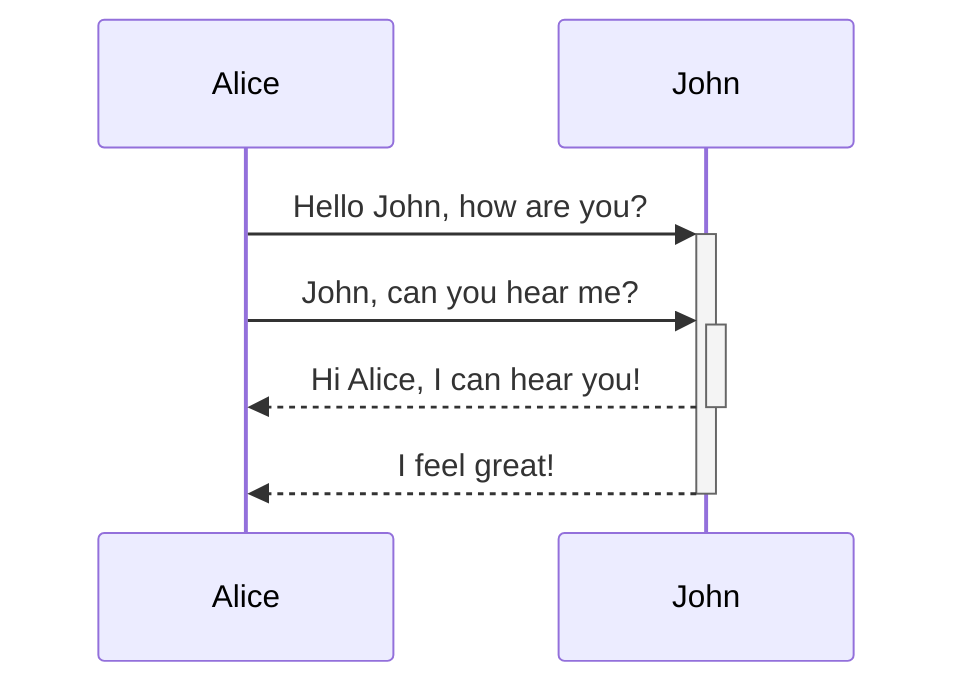

## 10月

——三大重点
1. 技术分析
2. kpi目标
3. 投资理财

### 10.19

The length of the hypotenuse: $c=\sqrt{a^2+b^2}$
Chemical formula of water: $\ce{H2O}$
The determinant of 2-by-2 matrices is given by

### 10.8

脚踏实地
实事求是
珍惜感恩
少说多做
深度分析
结果导向
低调务实勤奋感恩，成事
不说屁话（大道理），直击要害

化抽象为具体，化整为零
不在非重要事项上浪费时间、精力及金钱

明确出差目标及策略
三思而后行
谋定而后动
逆行人生
1，家和万事兴
2，投资消费，量力而行
3，天道酬勤，苦干加巧干

[散户如何在牛市时做到不亏钱且还能赚钱？](https://mp.weixin.qq.com/s/1yJ6b02B8MfnxdCHND_JUg)

以下是十大策略：

1、设定明确的止盈与止损目标。在牛市中，设定明确的止盈目标和止损底线，以防市场突然反转。获利时可以适时逐步减仓，将部分利润锁定，避免过度追求最大化收益。

2、坚持资产配置与分散投资。不要把所有资金投入单一资产或股票，即使是牛市中也应保持资产的多样性。通过分散投资，可以有效降低系统性风险，避免单个行业或公司波动带来的大额亏损。

3、避免追高和加杠杆。在牛市中避免因为“错失恐惧”（FOMO）而追高买入，尤其是当市场已经大幅上涨时。也不要轻易使用杠杆，牛市虽然上涨快，但回调也会非常猛烈，杠杆会放大亏损风险。

4、冷静面对市场情绪，避免盲目从众。牛市时市场情绪极为乐观，但要保持独立判断，避免盲目跟随他人买入。对所投资的标的保持清醒认识，特别是要避免因为看到他人赚钱而跟风追高。别去比较，比较是万恶之源。

5、基于基本面进行投资。即使在牛市中，也应该坚持基本面分析，选择那些有良好业绩支撑、估值合理的股票。避免购买那些因为市场情绪推高而估值过高的“热门股”。假如你买的是一只符合价值投资者的股票，长期持有，啥时候都是牛市。--当然，在A股买到这类公司很难很难。

6、保持适度的风险控制。不论牛市多么繁荣，都应保留一定的现金头寸以应对市场可能的回调。做好仓位管理，确保投资组合的风险水平在可控范围内。

7、适时逐步卖出而非一把清仓。在牛市接近尾声时，逐步减少持仓，而不是等到市场开始下跌再匆忙卖出。分阶段卖出可以确保部分利润锁定，减少心理压力和市场波动带来的不确定性。当然，这个建议也许不适合某些非常规环境。你也知道，地球越来越“非常规”了。

8、关注市场信号和宏观经济环境。牛市结束前常有一些征兆，例如市场的过度乐观情绪、成交量异常增大等。要时刻关注这些信号，以及宏观经济环境的变化，来判断牛市是否进入尾声阶段。简而言之，要边打边撤，而不是越杀越疯。

9、提前规划退出策略。为每一笔投资设置明确的退出策略，不仅包括止盈点，还包括在市场发生逆转时应采取的行动。明确的退出计划有助于在市场回调时迅速作出理性反应，避免因为情绪波动而造成不必要的亏损。

10、保持理性，管理心理偏差。牛市往往会放大人的贪婪和盲目自信，需时刻提醒自己理性看待投资。避免“确认偏误”和“盲目乐观”，通过定期回顾投资逻辑，确认投资标的是否仍然符合初衷。

通过这些策略，散户可以在牛市中既享受市场上涨带来的收益，又能有效控制风险，从而真正做到在牛市中不亏钱甚至赚钱。关键在于理性投资，避免被市场情绪裹挟，制定清晰的投资计划并严格执行。

对于投资者，格雷厄姆建议： 投资组合最好不要有中小盘股，因为他们在牛市中总是被高估。进取型投资者只有在确信买得便宜时才能介入。

为什么在牛市中，选择指数投资往往是一个比较好的选择？特别是对散户而言。

原因如下：

1、分散风险。指数代表了市场中一篮子股票，分散了个股风险。相比于投资单一股票，指数投资可以有效减少个股波动对投资组合的影响。这在牛市中尤为重要，因为即使大盘上涨，某些个股也可能表现不佳。

2、享受整体市场增长。牛市的特点是大部分股票都在上涨，而指数能够很好地捕捉整体市场的涨幅。通过投资指数，投资者能够比较全面地享受到整个市场上涨带来的收益，而不必担心个股的表现不如预期。

3、规避个股选择风险。在牛市中，有些个股可能被过度炒作，估值远高于合理水平，这样的股票在市场回调时容易出现大幅下跌。而指数投资可以避免选择错误的个股导致的亏损，因为它代表的是市场的平均表现。

4、费时少、操作简单。选择个股需要做大量的研究和分析，但指数投资则相对简单，不需要耗费大量时间来挑选和跟踪个股的基本面变化。对于没有太多时间或精力进行深入研究的散户来说，指数是一种更为简单有效的投资方式。

5、较低的交易成本。通过ETF等工具来投资指数，其交易成本通常低于频繁买卖个股。同时，指数基金的管理费也低于主动型基金，这使得长期持有指数投资具有成本优势。

6、跟随市场趋势。在牛市中，指数一般会比较稳定地跟随市场趋势上涨，而个股的表现则可能因不同因素而波动。投资指数可以减少散户追涨杀跌的风险，使其能够更理性地参与牛市。

7、适合长期投资。即使牛市过后进入熊市，指数投资也具有长期增长的潜力。历史表明，市场整体在长期内呈上涨趋势，因此，选择指数作为长期持有的标的，可以帮助投资者熨平牛熊周期的波动。但是，对于A股的历史，请您自行斟酌。

8、不容易受市场情绪影响。个股受情绪和消息面的影响较大，而指数更多地反映了整个市场的平均表现，波动相对较小。在牛市中，某些个股可能因短期的热点被迅速拉高，导致泡沫，但指数由于包含多只股票，相对稳定，更不容易因为单一事件而出现极端波动。再有，真不行了，也容易跑路。

真是奇怪，当几乎所有人都相信这是一个牛市的时候，几乎所有人都在思考如何跑路。大家都有风险意识，也挺好。据说“CIA”手册里有这样一句话：“永远不要走进你不知道如何走出的房间。”不过，即使房间有出口，历史的经验教训表明：‍很少有人愿意主动离开狂欢的舞会。‍

### 10.9

养成良好的工作及作息习惯
充沛的精力，持续强化大脑

7:00-7:45（学习）
7:45-8:00（洗漱）
8:00-8:20（早餐）
8:20-9:00（上班）

1、早上更新及得到学习（每天一本书）
2、聚焦工作目标及重点（每天一件事，提好问题及配置好资源）
3、投资理财及睡后收入（选择好公司及专业人士）

吴军、吴伯凡、刘润、万维刚

尝试一条不一样的方法及策略
深度思考及行动，兼顾长远及全局

好的开始是成功的一半
躬身入局，身体力行，身先士卒

19:30 日报及计划
20:00 下班
21:00 洗漱
22:00 睡觉

学习又分为广义上的学习和狭义上的学习。前一种包括我们常说的学做人，思想上的修行等等，后者是特指知识、技能和方法方面的学习。

在大学应该学的东西用一句话来讲，就是未来生活中所需要的常识、知识、技能和方法。请注意，我这里用了“生活”而不是“职业”二字。在中国，大学给每一个学生安排的课表，总的来讲，是针对你的职业的，不是针对你的生活的。

很多人问我，为什么你从一个领域转型到另一个领域那么容易，在大学时为什么会想到学很多看似和专业无关的东西。我其实一开始也没有太在意这个问题，不过后来问的人多了，我仔细地想了想其中的原因，最后我把它归结为“为了生活而学习”，而不是“为了专业而学习”。

现在即使给他一个亿，他也未必能够娶到美女，因为美女未必喜欢他。保时捷的车自然买得起，但是是否能体会开车的快乐就不知道了。想要把车开好，也需要学习。至于米其林餐厅，很多餐厅除非你提前三个月预订，否则不是你想吃就能吃到的，你是否有本事提前两天就能订到位子，这又需要有特殊的本事了。

当然最好是别人花钱请你吃，可为什么别人要花钱请你吃呢？这显然又不是有钱就能做到的了。就算有人请吃这样的大餐，你是否能体验其中的文化呢？也就是说，即使给了大家一个亿的现金，想过一个好的生活，依然需要具有各种知识和技能。事实上，在美国那些中了乐透彩票大奖的人，绝大部分在几年后又回到了贫穷状态。

大部分中国人上大学不仅仅是为了书中其实并不存在的黄金屋，而且是为了自我的满足（有面子也好，喜欢知识也好），对父母的回报（这一点我不是很赞同，但是这是现实），让自己变为有用、有益和有品位的人，这样自己能够有幸福的家庭和富裕的生活，获得社会的认可。

志向更高远的人会说类似改变世界的话。这些目标有些比较实在，有些比较务虚，但都是好的。如果我们把大学生在校学习的时间和所学的内容，按照上面这些非常朴素的目标分类统计一下，就会发现大部分学习和这些目标无关。

很多人想以后找一个好妻子或者好丈夫，但是他们不知道从何做起，更不要说懂得女生或者男生的心思。很多人说将来要创业当老板，但是在大学里从来没有锻炼过领导能力。一些人要当科学家，在大学里虽然学了很多课程，但是却没有得到很好的科学研究训练，更欠缺的是，他们没有得到过“发现问题”的训练。在科学研究上，发现问题和解决问题同样重要，甚至更重要。

为什么你说的这些事情不能以后再学呢？当然可以，但大学是学习这些知识和技能最好的时间，这不仅因为18-22岁的人的记忆力和理解能力非常好，可塑造性强，更关键的是大学生们时间最灵活。真到了工作时，一个人的时间很难完全由自己支配。如果一个大学生意识到他在大学四年里，所需要学习的东西远不止课堂上那点内容，他恐怕就不会荒废时间去打游戏，或者晚上经常到校门外的小摊上去吃小吃了。

在大学里要学什么呢？我觉得有四方面的技能和本领必须学习，或者说相应的习惯必须养成：

1. 付诸行动的习惯

世界上的事情，都是做出来的，不是说出来的。很多人都奇怪特朗普这样一个毫无政治经验，自己身上毛病一大堆的人为什么能竞选成功当上总统。这里面的原因很多，其中很重要的一条就是，他是一个付诸实践的人。世界上喜欢说的人多，愿意做事情的人少，不仅常人如此，其实很多商界领袖和政治精英常常也是如此。如果你稍微注意一下新闻就会发现，那些政客和企业家说的话有一半没有认真去落实。

举一个大家看得到的例子，中国的BAT（百度、阿里巴巴、腾讯）三家公司说要国际化，已经说了10年，但是到今天都没有认真落实过。当然在这三家公司里工作的人可能会说，你说的不对，我们一直在海外办公室招聘人才，等等。但是，那些门可罗雀的办公室，加上几个二三流的工程师，要和Google、Facebook竞争，不过是痴人说梦，因此他们仅仅是做给投资人看的。

相反，微软、Google等公司进入中国，可是出大价钱，给最好的福利，雇最好的人，认认真真地办这件事。正是因为爱说不爱做的人很多，这恰恰给了少数实践者成功的机会。比如，华为并没有天天把国际化挂在嘴边，而是实实在在地做了，到今天绝大多数的收入都来自海外。

谁也不是天生就能够做到“凡事付诸行动”的，这种习惯要靠长期培养，关于这一点以后有机会我们还可以展开讨论，不过在这里我先把我的这个结论分享给你，就是要尽可能在大学养成这个习惯。我昨天讲大学生必须要有意识地参加社会活动，这是养成付诸行动这个好习惯的最好的训练方式，因为大学是年轻人可以主动做事情的时候。在课堂上，老师是主动的，学生是被动的，因此课程的学习对这种技能的提高帮助不大。

2. 沟通能力和表达能力

人除了吃饭睡觉，大部分时间都是用在了通信上，这包括聊天、讨论工作、表达感情，也包括书写信件、短信，以及阅读新闻和收听音频、观看视频节目等等。从19世纪中期开始，人类的进步史在很大程度上就是通信革命的历史。

通信的目的，一是表达自己的思想和意愿，二是接受知识和信息，三是双向的沟通。无论是表达自己的思想，还是沟通，都是未来生活必要的能力，这种能力越强，生活和工作越方便，越容易成功。总的来说，中国人在表达和沟通上是弱项，在年轻的时候应该学会。今天，很难想象缺乏这两种能力的人能够事业有成，家庭幸福。

3. 表示友善和爱的能力

我们在生活中经常见到很多人试图表达好感，但是却适得其反，他们很郁闷，而别人也很尴尬。表达友善的能力非常重要，小到个人，大到国与国之间，都需要这种能力。比友善更进一步的是爱，既包括男女之间的感情，也包括爱慕、慈爱或者欣赏。不论是哪一种，人都需要懂得如何表达。我在前面提到，很多人就算给他一个亿，也未必能赢得美人芳心，因为他不知道如何表达爱。这个能力是必须学会的。

4. 总结、写作和逻辑推理的能力

很多人能够进行有效的沟通，却不能把自己的意思用书面语表达出来。这样的人很难把事情做得很深入，因为只有善于写作和记录，总结第一次成功的经验，或者某一次失败的教训，才能让自己做第二件事的时候站在第一次的基础之上，第三次站在第二次的基础之上，这样才有叠加效应，能不断前进。

人的记忆力是有限的，不可能做到第十次事情时，能够把前九次的细节记得一清二楚。因此，很多人做事情总是不断重复错误，很难获得叠加式的成功。对于理工科学生，我一直认为必须给他们开设写作课。而对于文科学生，我觉得必须给他们开设逻辑课，因为我们的媒体中有太多缺乏逻辑的文章，包括很多社论，前提和证据完全推不出结论。一个缺乏逻辑的论述是难以让人信服的，如果一个人讲话无法让人信服，他的生活能好到哪里去呢？

此外，还有很多能力需要培养，比如适当的组织能力，发现和欣赏美好事物的能力，等等。但是如果能够掌握上面四类基本能力，大学就没有白读。当然，有些能力和课程的学习是一致的，但是有些则需要在课外各种场合学习。在大学里需要学的东西特别多，学都学不完，但是它们都应该围绕“生活”二字。想到有那么多东西可以学，为什么要花大量的时间逛摊儿和打游戏呢？

